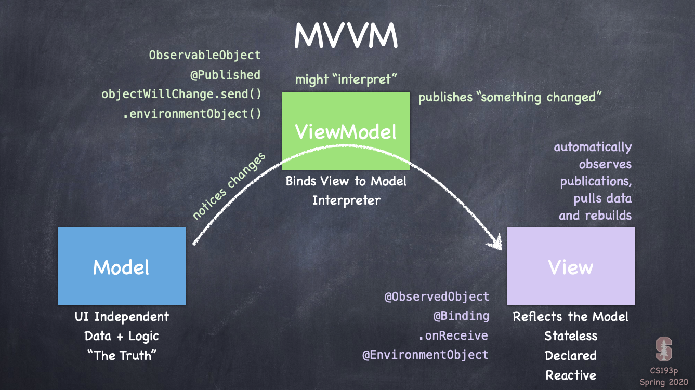
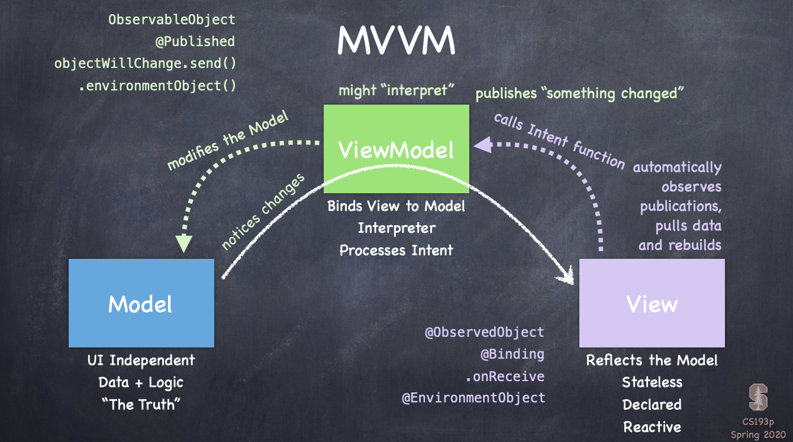

## MVVM
- MVVM 与"reactive" user-interfaces的概念一致, cannot do SwiftUI without it

- M: Model, V: View, VM: ViewModel

- Model encapsulate data and logic

- Data always flows from model to view. View reflects the model, and view is stateless (only model has the state) and declarative (declarative[陈述式] means declare the view looks this way and only change anything on screen when the model changes)

- no calling function(imperative) to put things in places, just create those views e.g Text..(declarative)

- Structs are read-only by default, no one is allowed to call a function that would change it, you can sure the view is always gonna look like exactly what you see in the code that you've declared right in front of you, and declarative is time-independent, this is a big improvement over imperative[命令式] models for UI

- imperative的劣势: hard to manage all function to be called and prove UI really works

- View is reactive, anytime the model changes, it's going to automatically update the view

- ViewModel binds View to Model, once one change has happened in the model, the view get reflected. ViewModel interprets the Model for the View, converting the data from one data type to another, it can simplify data to some simpler data structures that it can pass to the View, it will let the View be simple code that draws it. So ViewModel also acts as an interpreter of Model data

- ViewModel: notices changes in the Model, it might interpret data when data changes, and then publishes something changed, ViewModel does not have any pointers to any Views

- The view subscribes to that publication and when it sees something changed, it goes back to the ViewModel and asks: what's the current state of the world, it pulls the data from ViewModel, then the View draw itself to match the state of the world

- 

- When View wants to change the Model, add "Processes Intent" to the ViewModel. When the use is going to have the intent of some action, it's up to the ViewModel to process these intents and it does this by making functions available to the View to call to make the intent clear. View is going to call an intent function in the ViewModel. When the ViewModel receives the function called on them, they will modify the model, the ViewModel knows all about the Model and it's represented, if the Model is SQL, it's gonna be issuing sql commands to change the Model. if the Model is struct, then it's just setting vars or calling function in the Model to modify. All what ViewModel do is to express user's intent in changing the Model

- Then ViewModel notices changes the Model made, ViewModel pulishes something changed, then the View sees something changed, and it automatically redraws itself.

- 

## Type System in Swift
上次听到15:00