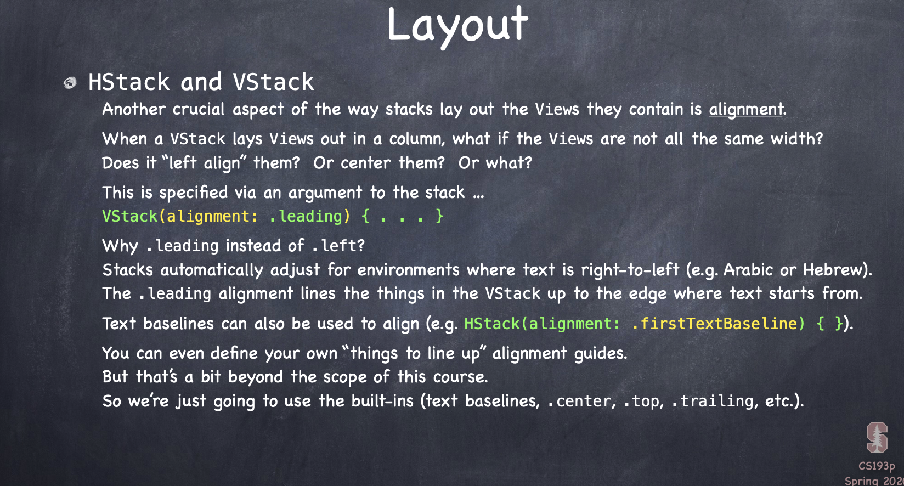
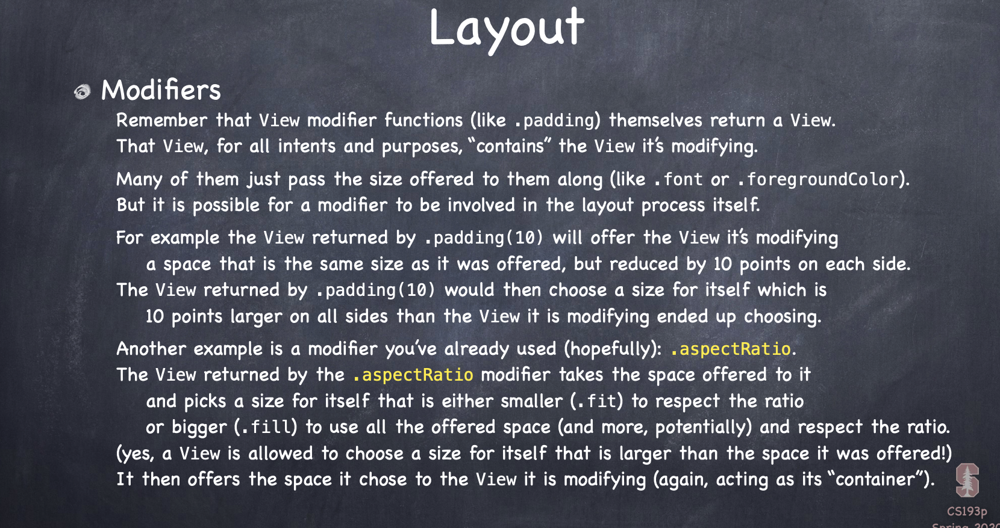
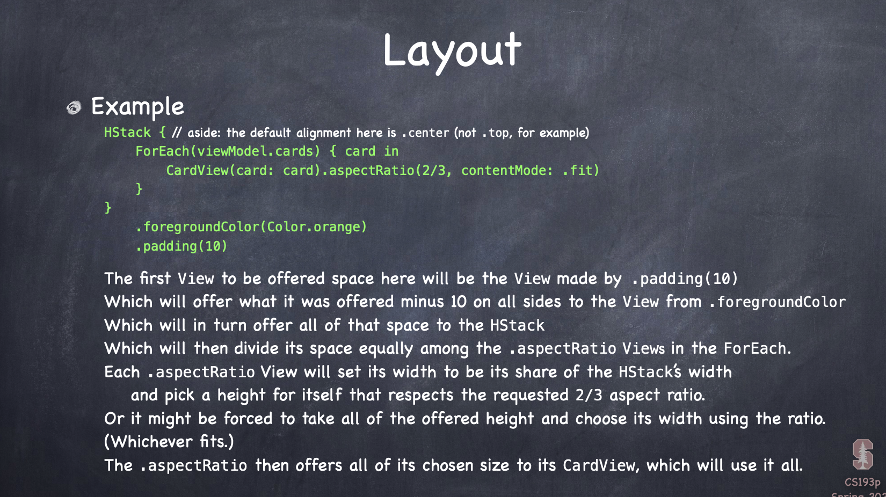
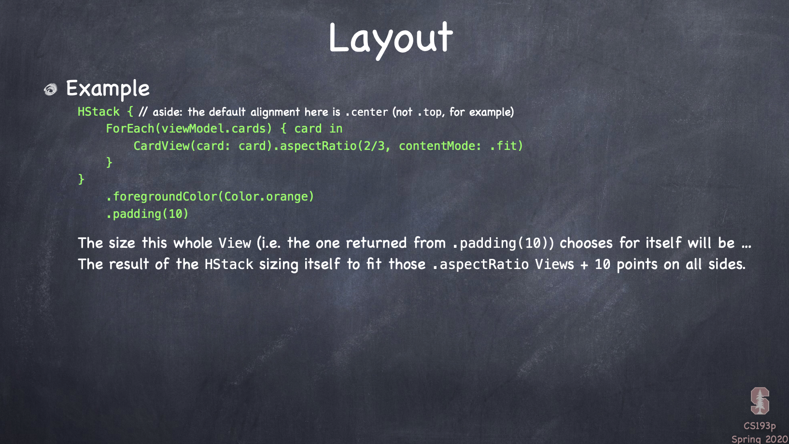
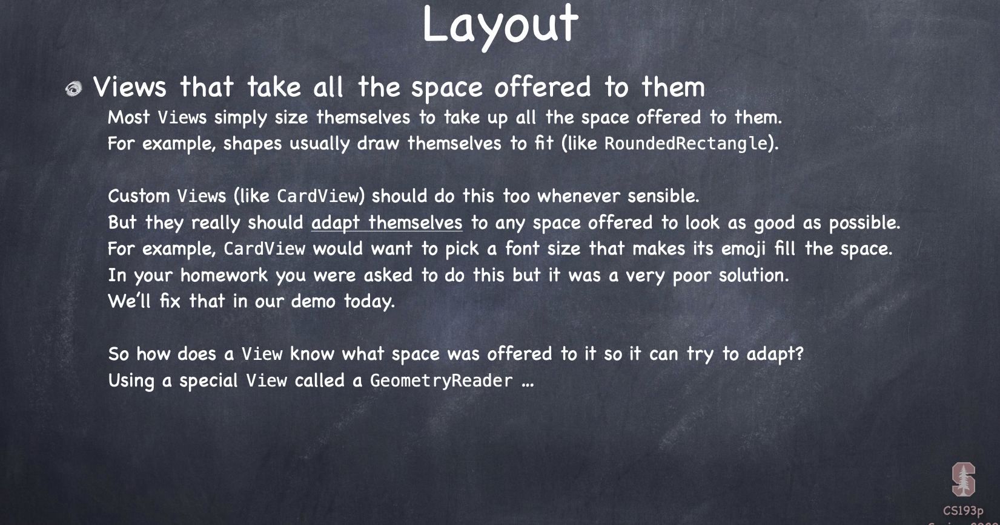
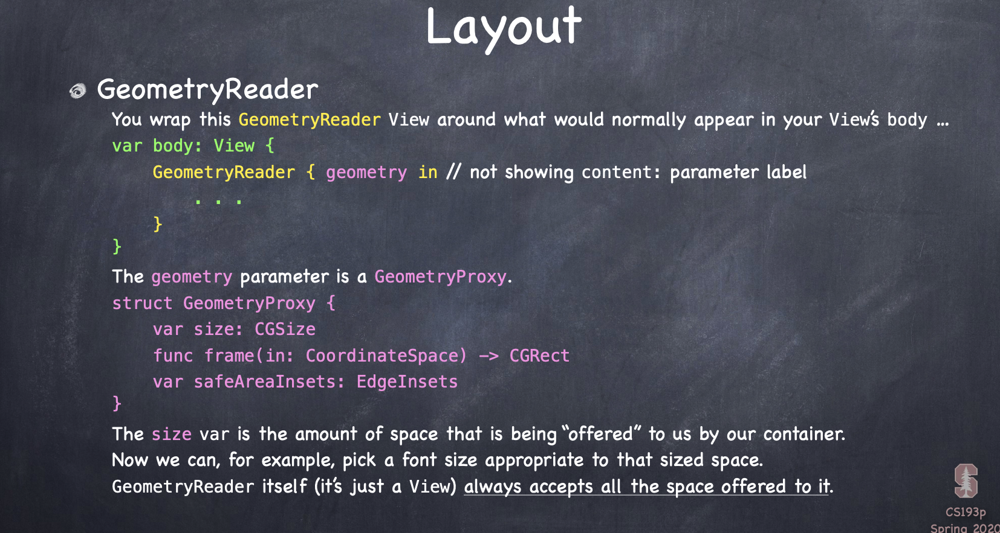
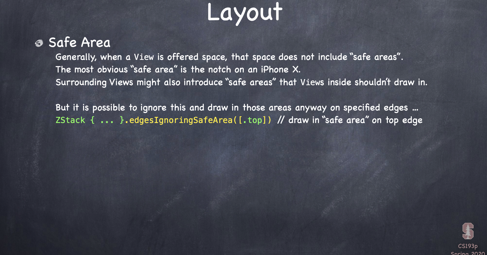
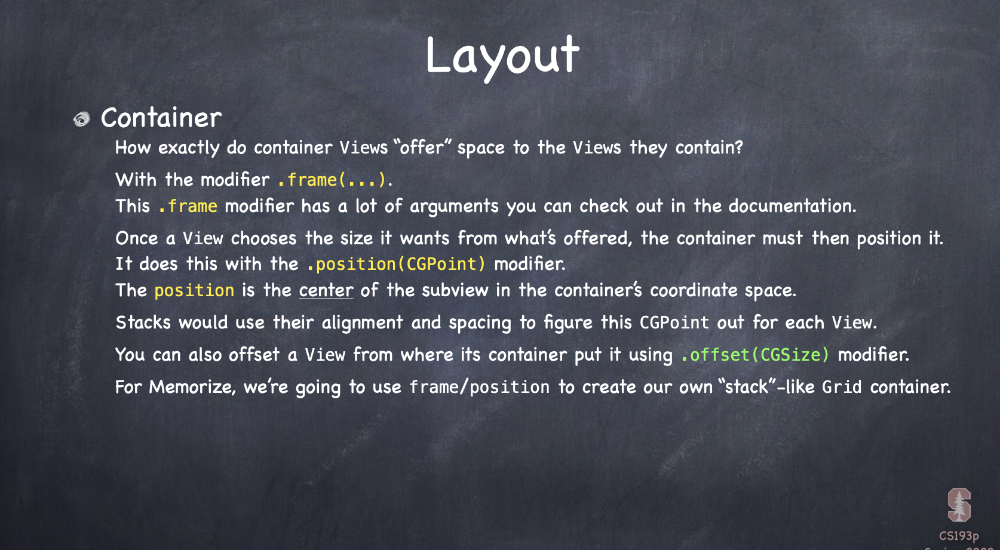

## Coding
- ```.font(Font.largeTitle)``` modifies the View we send it to, so that it uses this font to draw. In declarative programming we've just declaring that this is the font that is used to draw this View, for imperative, I'm calling this function to set the font at a certain moment in time. And there's no moment in time with this declarative, at any moment in time, declarative programming should draw the View that reflects the Model, it's time-insensitive
- vars cannot be created inside these ViewBuilders
- Reactive: when changes happen in the Model, they automatically are going to show up in the View
- ALL functions that modifies self have to be marked mutating in a struct. this is not true in class, class are in the heap, we have pointers to them, we can always change things that are in the heap, always modify things via pointers. for struct, we have to let swift know we're changing this using ```mutating```

### Reactive Programming
- Reactive, ViewModel: protocol: ObservableObject, you can only be a ObservableObject if you're a class
- ```var objectWillChange: ObservableObjectPublisher``` it's a publisher, meaning it can publish to the world, and our views are going to be interested when something changes. Everytime our Model changes, we want to do objectWillChange.send
    ```
    func choose(card: MemoryGame<String>.Card) {
        objectWillChange.send() // this is going to publish to the world
        model.choose(card: card)
    }
    ```
    objectWillChange meaning this MemoryGame will change, if this ViewModel changed, views that are looking to the portal need to redraw themselves
- for publisher in ViewModel, usually we make the model var pulished in ViewModel
    ```
    @Published private var model: MemoryGame<String> = EmojiMemoryGame.createMemoryGame()
    ```
    @Published is a property wrapper, property wrapper add a little functionality around a property, @Published means everytime this property model changes, it calls objectWillChange.send()
-   ```
    @ObservedObject var viewModel: EmojiMemoryGame
    ```
    for view, its var viewModel has an ObservedObject in it, and everytime this var viewModel says objectWillChange.send, redraw the view, SwiftUI is smart to see whether some views are changing, it's not going to redraw every views if just flip over one card

## protocol
- A protocol is sort of a “stripped-down” struct/class, It has functions and vars, but no implementation
    ```
    protocol Moveable {
        func move(by: Int)
        var hasMoved: Bool { get }
        var distanceFromStart: Int { get set }
    }
    ```
    The { } on the vars just say whether it’s read only or a var whose value can also be set.

    now any other type can claim to implement Moveable …
    ```
    struct PortableThing: Moveable {
        // must implement move(by:), hasMoved and distanceFromStart here
    }
    ```
    and this is also legal (this is called “protocol inheritance”)
    ```
    protocol Vehicle: Moveable {
        var passengerCount: Int { get set }
    }
    class Car: Vehicle {
        // must implement move(by:), hasMoved, distanceFromStart and passengerCount here
    }
    ```
    you can claim to implement multiple protocols
    ```
    class Car: Vehicle, Impoundable, Leasable {
        // must implement move(by:), hasMoved, distanceFromStart and passengerCount here
        // and must implement any funcs/vars in Impoundable and Leasable too
    }
    ```
    Most protocols can be used anywhere any other type can be used.
    For example, it can be the type of an argument to a function or of any variable
    ```
    var m: Moveable
    var car: Car = new Car(type: “Tesla”)
    var portable: PortableThing = PortableThing()
    m = car // perfectly legal
    m = portable // perfectly legal
    ```
    even though Car is a completely different class or struct than PortableThing.
    Both implement the Moveable protocol and so can be assigned to a var of type Moveable.
    Note, though, that this will not work
    ```
    portable = car // NOT legal
    ```
    The var portable is of type PortableThing (not Moveable) and a Car is not a PortableThing.
    Swift enforces the type of the var at all times.

## protocol extension
- One way to think about protocols is constrains and gains
    ```
    struct Tesla: Vehicle {
        // Tesla is constrained to have to implement everything in Vehicle
        // but gains all the capabilities a Vehicle has too
    }
    ```
    But how does a Vehicle “gain capabilities” if it has no implementation?
    You can add implementations to a protocol using an extension to the protocol
    ```
    extension Vehicle {
        func registerWithDMV() { /* implementation here */ }
    }
    ```
    Now Teslas (and all other Vehicles) can be registered with the DMV.
    Adding extensions to protocols is at the heart of functional programming in Swift.

- You can even add “default implementations” of the protocol’s own funcs/vars
    ```
    protocol Moveable {
        func move(by: Int)
        var hasMoved: Bool { get }
        var distanceFromStart: Int { get set }
    }
    extension Moveable {
        var hasMoved: Bool { return distanceFromStart > 0 }
    }
    struct ChessPiece: Moveable {
        // only need to implement move(by:) and distanceFromStart here
        // don’t have to implement hasMoved because there’s a default implementation out there
        // would be allowed to implement hasMoved here if we wanted to, though
    }
    ```
## extension
- Of course, you can use an extension to add things to structs and classes too.
    ```
    struct Boat {
        ...
    }
    extension Boat {
        func sailAroundTheWorld() { /* implementation */ }
    }
    ```
    You can even make something conform to a protocol purely via an extension
    ```
    extension Boat: Moveable {
        // implement move(by:) and distanceFromStart here
    }
    ```
    Now Boat conforms to the Moveable protocol!

## protocol
- Why do we do all this protocol stuff?
It is a way for types (structs/classes/other protocols) to say what they are capable of.
And also for other code to demand certain behavior out of another type.
- But neither side has to reveal what sort of struct or class they are.
- This is what “functional programming” is all about.
It’s about formalizing how data structures in our application function.
Even when we talk about vars in the context of protocols, we don’t define how they’re stored.
We focus on the functionality and hide the implementation details behind it.
It’s the promise of encapsulation from OOP but taken to a higher level.
- And this is even more powerful when we combine it with generics

## Generics and Protocols
- When we combine these don’t care types with constrain and gain, we get superpowers
    ```
    protocol Greatness {
        func isGreaterThan(other: Self) -> Bool
    }
    ```
    (by the way, the type Self means “the actual type of the thing implementing this protocol”)
    then we could add an extension to Array like this

    ```code below means that every Array where the Element, the don't care, conforms to Greatness will get this var greatness, this var greatness will not exist in Arrays where the don't cares don't implement the protocol Greatness```
    ```
    extension Array where Element: Greatness {
        var greatest: Element {
            // for-loop through all the Elements
            // which (inside this extension) we know each implements the Greatness protocol
            // and figure out which one is greatest by calling isGreaterThan(other:) on them
            return the greatest by calling isGreaterThan on each Element
        }
    }
    ```
## Layout
1. Container Views (HStack, ZStack, etc) “offer” space to the Views inside them. 
2. Views then choose what size they want to be
3. Container Views then position the Views inside of them
- The “stacks” (HStack, VStack) divide up the space offered to them amongst their subviews
- ForEach defers to its container to lay out the Views inside of it
- Modifiers (e.g. .padding()) essentially “contain” the View they modify. Some do layout.
### HStack and VStack
- Stacks divide up the space that is offered to them and then offer that to the Views inside.
- It offers space to its “least flexible” (with respect to sizing) subviews first.
- Example of an “inflexible” View: Image (it wants to be a fixed size).
- Another example (slightly more flexible): Text (always wants to size to exactly fit its text).
- Example of a very flexible View: RoundedRectangle (always uses the space offered).
- After an offered View(s) takes what it wants, its size is removed from the space available.
- Then the stack moves on to the next “least flexible” Views.
- Rinse and repeat.
- After the Views inside the stack choose their own size,the stack sizes itself to fit them.
---
- There are a couple of really valuable Views for layout that are commonly put in stacks …
- Spacer(minLength: CGFloat)
- Always takes all the space offered to it.
- Draws nothing.
- The minLength defaults to the most likely spacing you’d want on a given platform.
- Divider()
- Draws a dividing line cross-wise to the way the stack is laying out.
- For example, in an HStack, Divider draws a vertical line.
- Takes the minimum space needed to fit the line in the direction the stack is going
---

Stack’s choice of who to offer space to next can be overridden with .layoutPriority(Double).
In other words, layoutPriority trumps “least flexible”.
```
HStack {
    Text(“Important”).layoutPriority(100) // any floating point number is okay
    Image(systemName: “arrow.up”) // the default layout priority is 0
    Text(“Unimportant”)
}
```
The Important Text above will get the space it wants first.
Then the Image would get its space (since it’s less flexible than the Unimportant Text).
Finally, Unimportant would have to try to fit itself into any remaining space.
If a Text doesn’t get enough space, it will elide (e.g. “Swift is…” instead of “Swift is great!”).















